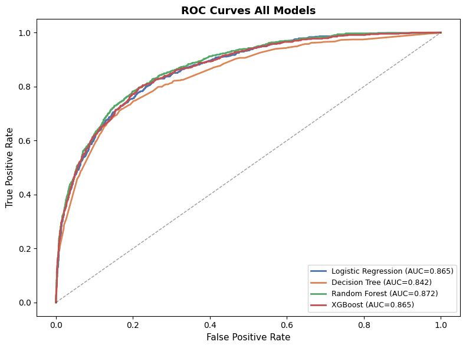
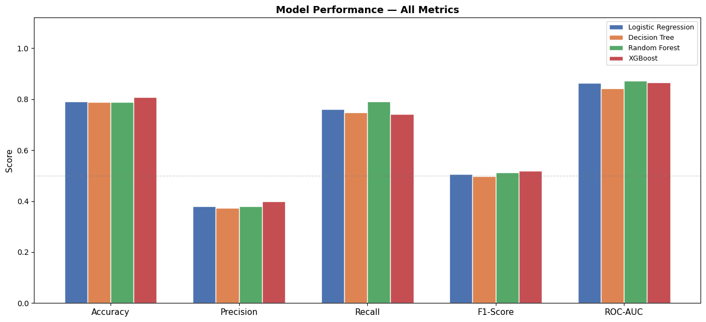
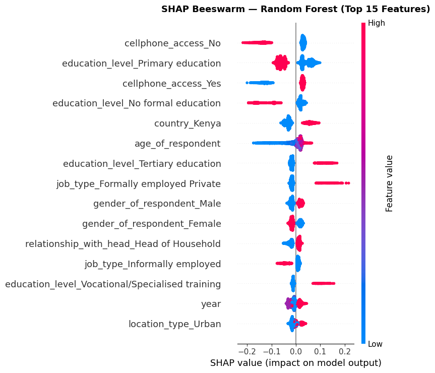

# Financial Inclusion Prediction — East Africa

> A comparative machine-learning framework that predicts whether an individual
> holds a bank account, and explains *why* using SHAP — the empirical core of my
> MSc dissertation.

## Overview

Using demographic and digital-access survey data from four East African
countries, this project benchmarks four classifiers and then opens the
"black box" with SHAP to identify the real drivers of financial inclusion. The
work is framed around explicit research questions (RQ1–RQ4) covering
discrimination performance, explanation consistency, subgroup fairness, and the
interpretability-vs-performance trade-off.

## Context

Empirical chapter of my **MSc Data Science & Business Analytics dissertation**.
Financial inclusion is a key development lever; the goal was not only to predict
who is unbanked, but to produce **policy-relevant, explainable** findings a
decision-maker could act on.

## Data

**Financial Inclusion in Africa** (Zindi) — survey respondents across **Kenya,
Rwanda, Tanzania and Uganda**.

| Property | Value |
|---|---|
| Records | **23,524** |
| Features | 12 predictors (demographics, location, digital access) |
| Target | `bank_account` (Yes / No) |
| Class balance | **14.1%** banked vs **85.9%** unbanked (imbalanced) |

The dataset is **not** committed — see [`data/README.md`](data/README.md) for the
download link and setup.

## Approach

1. **Preprocessing.** A scikit-learn `ColumnTransformer` (one-hot encoding for
   categoricals, scaling for numerics) inside a `Pipeline`, with a stratified
   train/test split and a fixed `RANDOM_STATE = 42` for full reproducibility.
2. **Modelling.** Four classifiers — **Logistic Regression, Decision Tree,
   Random Forest, XGBoost** — evaluated on accuracy, precision, recall, F1 and
   ROC-AUC, with **5-fold stratified cross-validation** for stability.
3. **Robustness.** Threshold tuning, learning curves, and subgroup analysis
   (by gender and country) to check performance stability.
4. **Explainability.** **SHAP** applied to all four models (TreeExplainer for
   tree models, LinearExplainer for LR), plus a cross-model consistency check.

## Results

Test-set performance (best value per column in **bold**):

| Model | Accuracy | Recall | F1 | ROC-AUC | CV-AUC (5-fold) |
|---|:---:|:---:|:---:|:---:|:---:|
| Logistic Regression | 0.791 | 0.761 | 0.506 | 0.865 | 0.847 ± 0.010 |
| Decision Tree | 0.788 | 0.748 | 0.498 | 0.843 | 0.831 ± 0.015 |
| **Random Forest** | 0.789 | **0.790** | 0.513 | **0.872** | **0.858 ± 0.012** |
| XGBoost | **0.807** | 0.742 | **0.520** | 0.865 | 0.846 ± 0.010 |

**Random Forest achieved the best ROC-AUC (0.8722)** and the best recall — the
most important metric here, since missing an unbanked individual is costlier
than a false alarm in a financial-inclusion context.





### Explainability (SHAP)

SHAP rankings were **highly consistent across all four models** (Spearman
ρ = 0.71–0.96). The dominant drivers of financial inclusion were:

1. **Education level** — higher education strongly increases the odds of being banked
2. **Mobile phone access** — a key enabler of financial inclusion
3. Country, job type, and age as secondary factors



## Key takeaway

The best pure-performance model (Random Forest, ROC-AUC 0.872) beat Logistic
Regression by only **+0.008 AUC**, while being far less transparent. Because SHAP
provides faithful post-hoc explanations, the practical recommendation is:
**Logistic Regression + SHAP** where policy transparency matters, and
**Random Forest + SHAP** where raw discrimination performance is the priority.
Substantively, **education and mobile-phone access are the two biggest levers**
for expanding financial inclusion in East Africa.

## Tech stack

Python · scikit-learn · XGBoost · SHAP · pandas · NumPy · matplotlib · seaborn

## How to run

```bash
# 1. Install dependencies
pip install -r requirements.txt

# 2. Add the dataset (see data/README.md)
#    data/Train.csv

# 3. Launch Jupyter and run the notebook
jupyter notebook
#    notebooks/financial_inclusion_analysis.ipynb
```

## Contact

**Dougoukolo Konaré** — konaredougoukolo0@gmail.com
